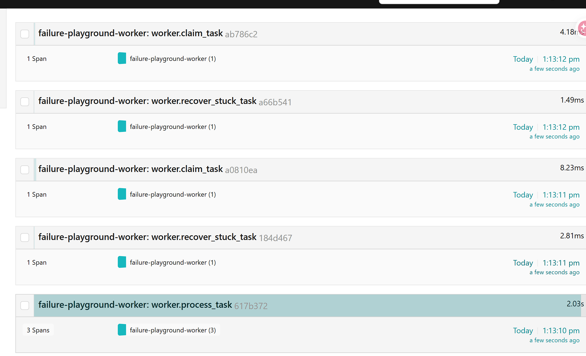

# Failure Playground

**Failure Playground** is a local **platform engineering playground** focused on distributed worker systems, observability, and failure handling.

It simulates a production-style asynchronous task-processing system using FastAPI, PostgreSQL, Redis, Prometheus, Grafana, OpenTelemetry, and Jaeger — built specifically to explore how backend infrastructure behaves under failure.

> The goal is not to build a business application. The goal is to understand how backend systems behave **under retries, partial failures, stuck workers, and queue pressure** — and how to observe that behavior in practice.

---

## Project Identity

Failure Playground is currently a **feature-complete local backend/platform engineering playground** focused on distributed worker systems, observability, and failure handling.

The current version includes:

- Redis-backed task queues
- Worker retry / recovery systems
- Structured logging
- Prometheus + Grafana metrics
- OpenTelemetry + Jaeger tracing
- Dockerized local infrastructure
- CI validation

---

## What This Project Explores

This project is built to explore real backend operational concerns, not CRUD APIs:

- Worker coordination and lifecycle
- Retry strategies and backoff
- Stuck task recovery
- Queue pressure and backpressure behavior
- Poison task handling
- Heartbeat-based liveness tracking
- Structured operational logging
- System-level metrics
- Distributed tracing across services
- Infrastructure debugging
- Operational visibility

---

## Core Stack

### Backend

- FastAPI
- SQLAlchemy
- PostgreSQL
- Redis

### Infrastructure / Platform

- Docker Compose
- Prometheus
- Grafana
- OpenTelemetry
- Jaeger
- GitHub Actions CI
- Alembic database migrations

---

## Architecture

```
                           Browser (operational UI)
                                    |
                                    v
                              FastAPI API
                                    |
        +---------------------------+---------------------------+
        |                           |                           |
        v                           v                           v
   PostgreSQL                     Redis                     Prometheus
   - tasks                        - task queue              - scrapes /prometheus
   - task logs                                                    |
   - worker heartbeats                                            v
   - system state                                              Grafana
        ^                           ^
        |                           |
        +---------- Workers --------+
                       |
                       +--> OpenTelemetry --> Jaeger
                                                ^
                                                |
                          FastAPI API ----------+
                          (API + worker traces)
```

The system has two independent process classes — the **API** and the **workers** — communicating through Redis (queue) and PostgreSQL (state), with Prometheus, Grafana, and Jaeger providing the observability plane.

---

## Backend Systems

### Task Queue

Redis is used as a list-based task queue. The API enqueues task IDs; workers consume them independently. PostgreSQL is the source of truth for task state — Redis is treated as a transport, not as state.

This separation is intentional: it forces the system to handle the realistic case where the queue and the database can disagree (lost messages, double-claims, stuck rows).

### Persistence

PostgreSQL stores:

- Task status, retry count, timestamps
- Failure reason and poison-task flags
- Task logs
- Worker heartbeat records
- System pause/resume state

Schema is managed through Alembic migrations, which run automatically on API container startup.

### API Surface

The FastAPI service exposes endpoints for task creation, queue inspection, worker state, alerts, system controls, logs, health, and metrics. It is the control plane — workers do not expose HTTP.

---

## Worker Coordination

Workers are the heart of the project. They run as independent processes and are responsible for the actual task lifecycle.

### Responsibilities

- Pull task IDs from Redis
- Claim queued tasks (transition `queued → processing`)
- Simulate success, failure, or retry
- Apply exponential backoff for retries
- Detect and mark poison tasks as permanently failed
- Write structured task logs
- Emit heartbeat updates

### Reliability Behaviors

- **Heartbeats** — workers periodically update a heartbeat row; stale workers are flagged as `stale`.
- **Stuck task recovery** — tasks left in `processing` past a timeout are recovered and re-queued or failed.
- **Retry cooldowns** — retries are scheduled, not immediate, to prevent tight failure loops.
- **Rate limiting** — workers throttle to avoid hammering downstream systems.
- **Processing timeouts** — long-running tasks are detected and handled.
- **Processing duration tracking** — measured per task for observability.

### Failure Scenarios Supported

- Random task failure
- Retry with backoff
- Permanently failed tasks
- Poison tasks
- Queue pressure
- Stale workers
- Duplicate task prevention
- System pause/resume
- Manual Redis queue clearing
- Degraded dependency health

---

## Observability

Failure Playground treats observability as a first-class concern, with three layers covering different questions:

| Layer   | Question it answers                         |
|---------|---------------------------------------------|
| Logs    | What happened?                              |
| Metrics | How often / how much?                       |
| Tracing | How did one task move through the system?  |

### Structured Logging

The backend emits structured JSON logs for:

- Task lifecycle events
- Worker behavior
- Retry activity
- Failure handling
- Heartbeat updates

Logs are designed to be machine-parseable and queryable, not human-decorative.

### Metrics (Prometheus + Grafana)

`/prometheus` exposes metrics in Prometheus text format:

- `failure_playground_tasks_queued`
- `failure_playground_tasks_processing`
- `failure_playground_tasks_success`
- `failure_playground_tasks_failed`
- `failure_playground_tasks_poison`
- `failure_playground_tasks_poison_failed`
- `failure_playground_redis_queue_length`
- `failure_playground_workers_alive`
- `failure_playground_workers_stale`

Grafana is provisioned through Docker Compose with a Prometheus datasource and a preconfigured dashboard visualizing queue pressure, worker health, failure rates, retry behavior, and processing throughput.

### Distributed Tracing (OpenTelemetry + Jaeger)

Tracing was added in v1.5 to inspect the lifecycle of individual tasks — something logs and metrics can't show directly.

Traced services:

- `failure-playground-api`
- `failure-playground-worker`

Custom worker spans:

```
worker.process_task
worker.claim_task
worker.retry_task
worker.fail_task
worker.complete_task
worker.recover_stuck_task
```

#### Successful task flow

```
worker.process_task
  ├── worker.claim_task
  └── worker.complete_task
```

#### Retry flow

```
worker.process_task
  ├── worker.claim_task
  └── worker.retry_task
```

#### Final failure flow

```
worker.process_task
  ├── worker.claim_task
  └── worker.fail_task
```

Worker polling itself is intentionally not heavily traced — empty queue polls would dominate Jaeger and obscure the meaningful task-processing spans.

Tracing is particularly useful for debugging retry behavior, stuck task recovery, worker processing time, queue-to-worker flow, and unexpected worker exceptions.

---

## Operational Dashboard

The browser dashboard is a **small operational tool**, not a product surface. It exists so the system can be poked at without curling the API.

It displays:

- Task status counts
- Worker heartbeat state
- Queue length
- Alerts
- Recent task logs
- Task and log lists with filters and pagination

Implementation is intentionally minimal: vanilla JavaScript, HTML/CSS, Chart.js, and polling. Real observability lives in Grafana and Jaeger.

---

## Key Endpoints

| Method | Endpoint         | Description                                 |
|--------|------------------|---------------------------------------------|
| GET    | `/`              | Operational dashboard                       |
| GET    | `/docs`          | FastAPI documentation                       |
| GET    | `/health`        | API, database, and Redis health             |
| GET    | `/metrics`       | Human-readable system metrics               |
| GET    | `/prometheus`    | Prometheus scrape endpoint                  |
| POST   | `/tasks`         | Create a normal task                        |
| POST   | `/tasks/poison`  | Create a poison task                        |
| GET    | `/tasks`         | Paginated, filterable task list             |
| GET    | `/logs`          | Paginated, filterable task logs             |
| GET    | `/workers`       | Worker heartbeat status                     |
| GET    | `/alerts`        | Operational alerts                          |
| GET    | `/system_state`  | Current pause/resume state                  |
| POST   | `/pause`         | Pause task processing                       |
| POST   | `/resume`        | Resume task processing                      |
| POST   | `/clear_queue`   | Clear Redis queue                           |
| POST   | `/reset`         | Reset system state                          |

---

## Running Locally

From the project root:

```bash
docker compose up --build
```

When the API container starts, it runs Alembic migrations before launching the FastAPI server.

Then open:

- API docs: <http://localhost:8001/docs>
- Dashboard: <http://localhost:8001>
- Prometheus: <http://localhost:9091>
- Grafana: <http://localhost:3000>
- Jaeger: <http://localhost:16686>

Default Grafana login:

```
Username: admin
Password: admin
```

Create a task:

```bash
curl -X POST "http://localhost:8001/tasks?priority=1"
```

---

## Tests

From the `backend` directory:

```bash
cd backend
pytest -v
```

The test suite covers task creation, queue enqueue/dequeue, queue length and clear behavior, all major API endpoints, system pause/resume, pagination and filtering, query validation, structured logging behavior, and the worker recovery / success / retry / final failure / poison paths.

Tests use pytest, FastAPI TestClient, a temporary SQLite database, and fake Redis for unit tests.

---

## CI

GitHub Actions runs the test suite automatically on push and pull request:

```
push / pull_request
        |
        v
install dependencies
        |
        v
run pytest
```

---

## Key Engineering Lessons

Building this project involved debugging several real operational and distributed-system problems:

- OpenTelemetry trace hierarchy issues
- Noisy polling traces drowning out meaningful spans
- Retry state loops
- Docker volume state resets
- PostgreSQL schema recreation across rebuilds
- Worker coordination edge cases
- Queue timing issues
- Observability design tradeoffs (what to trace vs. what to leave alone)

The project evolved from a simple task queue into a broader platform engineering sandbox.

---

## Current Status

**Current version:** `v1.5`

### Implemented

- Backend API
- Worker queue system
- Retries and failure handling
- Observability stack (logs + metrics + dashboards + traces)
- Distributed tracing
- Dockerized local infrastructure
- CI validation

### Current Limitations

This project is designed for local platform engineering learning, not production deployment.

- Polling-based dashboard (no WebSockets)
- No authentication or authorization
- Alembic migration history is minimal (project started with an existing schema)
- No Kubernetes deployment
- No external deployment target
- Long-term analytics rely on Prometheus/Grafana retention, not a custom system

---

## Potential Future Expansions

- Kubernetes manifests
- Celery / Kafka comparison
- Distributed locking
- Autoscaling
- Canary deployments
- Authentication / RBAC
- S3 backups
- WebSocket live dashboard
- Multi-service tracing beyond API + worker

## Screenshot


