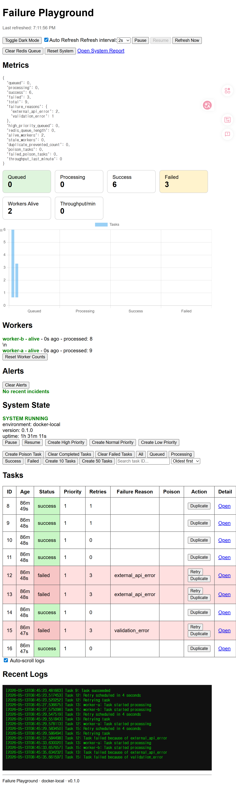
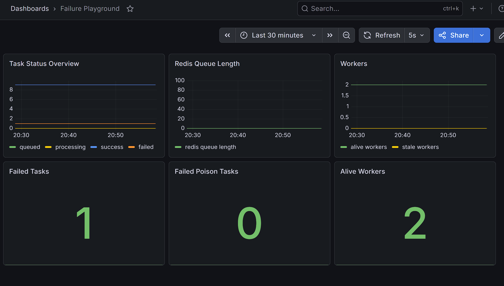

# Failure Playground

Failure Playground is a distributed task-processing playground for learning backend and platform engineering concepts.

It simulates a small infrastructure system with task queues, background workers, retries, failure handling, worker heartbeats, queue pressure alerts, structured logs, metrics, health checks, and an operational dashboard.

The goal is not to build a business application.

The goal is to understand how backend systems behave under failure.

---

## What This Project Demonstrates

- FastAPI backend API
- Redis-backed task queue
- PostgreSQL persistence
- Background worker processes
- Retry logic with backoff
- Poison task simulation
- Worker heartbeat tracking
- Queue pressure alerts
- System pause/resume controls
- Task and log pagination
- Task and log filtering
- Structured JSON logging
- Health check endpoint
- Human-readable metrics endpoint
- Prometheus metrics export
- Grafana dashboard provisioning
- Operational dashboard
- Docker Compose local infrastructure
- Automated tests with pytest
- GitHub Actions CI
- Alembic database migrations
- Worker recovery behavior
- Worker success, retry, final failure, and poison task test coverage

---

## Architecture

```txt
Browser Dashboard
        |
        v
FastAPI API
        |
        +--> PostgreSQL
        |       - tasks
        |       - task logs
        |       - worker heartbeats
        |       - system state
        |
        +--> Redis
        |       - task queue
        |
        +--> Prometheus
                - scrapes /prometheus

Workers
        |
        +--> Redis
        |       - consume queued task IDs
        |
        +--> PostgreSQL
                - update task status
                - write task logs
                - write heartbeat state

Grafana
        |
        +--> Prometheus datasource
```

---

## Components

### Frontend

The dashboard is intentionally simple and operationally focused.

It uses:

- Vanilla JavaScript
- HTML/CSS
- Chart.js visualizations
- Polling-based dashboard updates
- Task filtering
- Log filtering
- Pagination controls

The dashboard allows users to inspect the system state without needing to directly query the API.

---

### Backend

The backend is built with:

- FastAPI
- SQLAlchemy
- PostgreSQL
- Redis
- Pytest

The API provides endpoints for:

- Tasks
- Logs
- Metrics
- Workers
- Alerts
- System state
- Queue controls
- Health checks
- Prometheus metrics

---

### Queue

Redis is used as a list-based task queue.

Task IDs are pushed into Redis when tasks are created. Worker processes consume task IDs independently and update persistent task state in PostgreSQL.

---

### Database

PostgreSQL stores persistent system state, including:

- Task status
- Retry count
- Timestamps
- Failure reason
- Poison-task flags
- Task logs
- Worker heartbeat records
- System pause/resume state

---

### Workers

Independent background worker processes:

- Pull task IDs from Redis
- Claim queued tasks
- Mark tasks as processing
- Simulate success or failure
- Retry failed tasks
- Mark poison tasks as failed
- Write task logs
- Update heartbeat records

---

## System Flow

1. A user creates a task from the dashboard or API.
2. FastAPI stores the task in PostgreSQL.
3. FastAPI pushes the task ID into Redis.
4. A worker pulls the task ID from Redis.
5. The worker updates the task status to `processing`.
6. The worker either succeeds, fails, or retries the task.
7. The dashboard polls API endpoints and displays the current system state.
8. Prometheus scrapes `/prometheus`.
9. Grafana visualizes system metrics.

---

## Failure Scenarios

This project intentionally supports failure cases such as:

- Random task failure
- Retry with backoff
- Permanently failed tasks
- Poison tasks
- Queue pressure
- Stale workers
- Duplicate task prevention
- System pause/resume
- Redis queue clearing
- Degraded dependency health

---

## Observability

Failure Playground includes multiple layers of observability.

### Dashboard

The dashboard shows:

- Task status counts
- Worker heartbeat state
- Queue length
- Alerts
- Recent task logs
- Task list with filters and pagination
- Log list with filters and pagination

### Structured Logging

The backend emits structured JSON logs for important system events, including task creation, queue operations, worker lifecycle events, failures, and retries.

### Prometheus

The `/prometheus` endpoint exposes metrics in Prometheus text format.

Example metrics include:

```txt
failure_playground_tasks_queued
failure_playground_tasks_processing
failure_playground_tasks_success
failure_playground_tasks_failed
failure_playground_tasks_poison
failure_playground_tasks_poison_failed
failure_playground_redis_queue_length
failure_playground_workers_alive
failure_playground_workers_stale
```

### Grafana

Grafana is provisioned through Docker Compose with:

- Prometheus datasource
- Preconfigured dashboard
- Local observability panels

---

## Key Endpoints

```txt
GET  /                 Dashboard
GET  /docs             FastAPI documentation
GET  /health           API, database, and Redis health
GET  /metrics          Human-readable system metrics
GET  /prometheus       Prometheus scrape endpoint

POST /tasks            Create a normal task
POST /tasks/poison     Create a poison task
GET  /tasks            Paginated and filterable task list

GET  /logs             Paginated and filterable task logs
GET  /workers          Worker heartbeat status
GET  /alerts           Operational alerts

GET  /system_state     Current system pause/resume state
POST /pause            Pause task processing
POST /resume           Resume task processing
POST /clear_queue      Clear Redis queue
POST /reset            Reset system state
```

---

## Running Locally

From the project root:

```bash
docker compose up --build
```
When the API container starts, it runs Alembic migrations before launching the FastAPI server.

Then open:

```txt
Dashboard:   http://localhost:8001
API docs:    http://localhost:8001/docs
Prometheus:  http://localhost:9091
Grafana:     http://localhost:3000
```

Default Grafana login:

```txt
Username: admin
Password: admin
```

---

## Running Tests

From the backend directory:

```bash
cd backend
pytest -v
```

The test suite covers:

- Task creation service
- Queue enqueue/dequeue behavior
- Queue length and clear behavior
- `POST /tasks`
- `POST /tasks/poison`
- `GET /tasks`
- `GET /metrics`
- `GET /workers`
- `GET /alerts`
- `GET /logs`
- `GET /prometheus`
- `GET /health`
- System pause/resume state
- API pagination
- API filtering
- API query validation
- Structured logging behavior
- Worker recovery behavior
- Worker success path
- Worker retry path
- Worker final failure path
- Worker poison task path

Tests use:

- pytest
- FastAPI TestClient
- Temporary SQLite database
- Fake Redis behavior for unit tests

---

## CI

GitHub Actions runs the test suite automatically on push and pull request.

```txt
push / pull_request
        |
        v
install dependencies
        |
        v
run pytest
```

---

## Current Limitations

This project is designed for local infrastructure learning, not production deployment.

Current limitations:

- Dashboard uses polling instead of WebSockets
- No authentication or authorization yet
- Alembic is configured, but migration history is still minimal because the project started with an existing schema.
- No Kubernetes deployment yet
- No OpenTelemetry tracing yet
- No external deployment target yet
- Frontend is intentionally simple
- Historical metrics are handled by Prometheus/Grafana, not by a custom long-term analytics system

---

## Project Status

Failure Playground is currently close to a strong local v1 for a backend/platform engineering portfolio project.

The system includes a working API, Redis-backed task queue, PostgreSQL persistence, multiple workers, retry/failure simulation, poison tasks, structured logs, dashboard controls, Prometheus metrics, Grafana provisioning, health checks, Docker Compose orchestration, and a passing test suite.

The remaining work is mostly production hardening, documentation polish, and deployment-oriented improvements.

---

## Next Milestones

- Add screenshots of the dashboard and Grafana panels
- Add an architecture diagram image
- Add Alembic database migrations
- Improve worker test coverage
- Add OpenTelemetry tracing
- Add Kubernetes manifests
- Add deployment notes
- Consider authentication and admin roles
- Consider WebSocket-based live updates

---

## Screenshot


