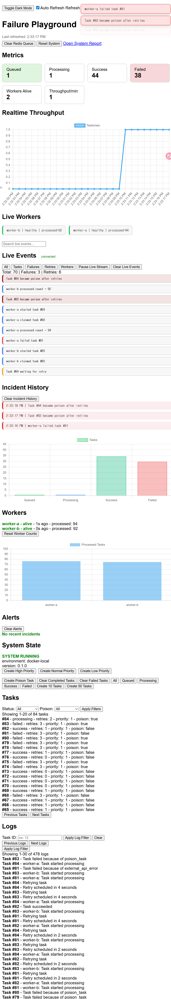
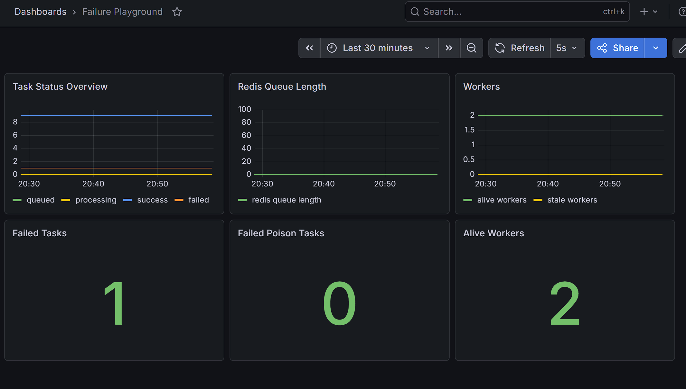
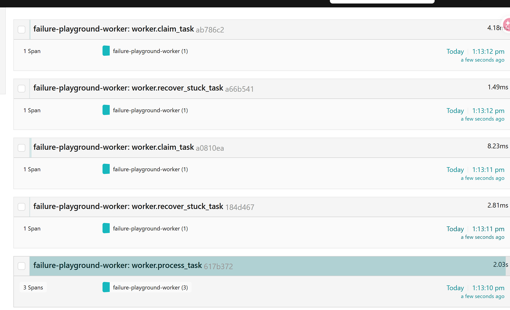

# Failure Playground

**Failure Playground** is a local **platform engineering playground** focused on distributed worker systems, observability, failure handling, and **realtime operational visibility**.

It simulates a production-style asynchronous task-processing system using FastAPI, PostgreSQL, Redis (with pub/sub), Prometheus, Grafana, OpenTelemetry, and Jaeger — built specifically to explore how backend infrastructure behaves under failure, and how operators see and respond to that behavior in real time.

> The goal is not to build a business application. The goal is to understand how backend systems behave **under retries, partial failures, stuck workers, queue pressure, and failure spikes** — and how to observe and react to that behavior the way an on-call engineer would.

---

## Current Status

**Current version:** `v2` — Realtime Operations Playground

v2 is the focus of this project today. It builds on the v1.5 backend/observability foundation and adds a live operational dashboard driven by Redis pub/sub and FastAPI WebSockets.

---

## v2 Realtime Operations Dashboard

The defining shift in v2: the dashboard is no longer a polling viewer of state — it is a **live operations console**.

Operators see events as they happen, get alerted on failure spikes, watch worker health degrade and recover, and inspect individual events without leaving the page.

### v2 Features

- **Redis pub/sub live event streaming** — workers and the API publish operational events as they occur
- **FastAPI WebSocket bridge** — `/ws/operations` streams those events to connected dashboards
- **Realtime worker heartbeat monitoring** — live worker cards update with each heartbeat
- **Stale worker detection + recovery tracking** — workers going stale and coming back are flagged automatically
- **Incident history timeline** — significant events (failures, spikes, stale workers) accumulate in a dedicated panel
- **Failure spike detection** — a sliding window over recent failures triggers a visible alert when threshold is crossed
- **Toast alert system** — transient notifications for important events without interrupting the operator
- **Event filtering + search** — filter live events by type (tasks/failures/retries/workers) and search across event payloads
- **Realtime throughput chart** — tasks-per-second over a rolling window, updated live
- **Poison task visualization** — poison events are flagged with a distinct severity level

### v2 Realtime Data Flow

```
Workers
   ↓
Redis Pub/Sub
   ↓
FastAPI WebSocket  (/ws/operations)
   ↓
Dashboard Live Events
```

The dashboard subscribes once via WebSocket and reacts to events as they arrive. No polling for the live panels.

### Dashboard Robustness

The v2 dashboard JS was hardened so missing UI elements degrade gracefully rather than crash the whole panel:

- Optional UI elements (toast container, incident history, event detail drawer, etc.) are guarded with null checks
- Event listeners are centralized in a single `initializeDashboardEventListeners()` function
- Functions that touch optional containers early-return if those containers aren't in the DOM

This makes the dashboard tolerant to partial HTML edits during development and tweakable for screenshots/demos.

---

## Dashboard Screenshots








---

## Project Identity

Failure Playground is a **feature-complete local backend/platform engineering playground** focused on:

- Distributed worker systems
- Observability (logs, metrics, traces, **and live operational signals**)
- Failure handling
- Realtime operator experience

---

## What This Project Explores

This project is built to explore real backend operational concerns, not CRUD APIs:

- Worker coordination and lifecycle
- Retry strategies and backoff
- Stuck task recovery
- Queue pressure and backpressure behavior
- Poison task handling
- Heartbeat-based liveness tracking
- Structured operational logging
- System-level metrics
- Distributed tracing across services
- **Realtime event streaming from infrastructure to operator**
- **Live failure detection and incident timelines**
- Infrastructure debugging
- Operational visibility

---

## Core Stack

### Backend

- FastAPI (HTTP + WebSocket)
- SQLAlchemy
- PostgreSQL
- Redis (queue + pub/sub)

### Infrastructure / Platform

- Docker Compose
- Prometheus
- Grafana
- OpenTelemetry
- Jaeger
- GitHub Actions CI
- Alembic database migrations

### Dashboard (frontend)

- Vanilla JavaScript (no framework)
- Chart.js
- Native WebSocket API

---

## Architecture

```
                           Browser (v2 operations console)
                                    |
                          HTTP + WebSocket
                                    |
                                    v
                              FastAPI API
                                    |
        +---------------------------+---------------------------+
        |                           |                           |
        v                           v                           v
   PostgreSQL                     Redis                     Prometheus
   - tasks                        - task queue              - scrapes /prometheus
   - task logs                    - pub/sub channel               |
   - worker heartbeats                                            v
   - system state                                              Grafana
        ^                           ^
        |                           |
        +---------- Workers --------+
                       |
                       +--> OpenTelemetry --> Jaeger
                       |
                       +--> Redis pub/sub --> FastAPI WS --> Dashboard
```

The system has two independent process classes — the **API** and the **workers** — communicating through Redis (queue + pub/sub) and PostgreSQL (state), with Prometheus, Grafana, Jaeger, and the realtime WebSocket providing the observability plane.

---

## Backend Systems

### Task Queue

Redis is used as a list-based task queue. The API enqueues task IDs; workers consume them independently. PostgreSQL is the source of truth for task state — Redis is treated as a transport, not as state.

This separation is intentional: it forces the system to handle the realistic case where the queue and the database can disagree (lost messages, double-claims, stuck rows).

### Realtime Event Bus (v2)

Alongside the queue, Redis is also used as a **pub/sub bus** for operational events:

- Task lifecycle events (`task_created`, `task_started`, `task_succeeded`, `task_failed`, `task_retried`, `task_poisoned`, etc.)
- Worker events (`worker_heartbeat`, processed-count updates)

These events are published by workers and the API as they happen, and bridged to the dashboard via a FastAPI WebSocket endpoint.

### Persistence

PostgreSQL stores:

- Task status, retry count, timestamps
- Failure reason and poison-task flags
- Task logs
- Worker heartbeat records
- System pause/resume state

Schema is managed through Alembic migrations, which run automatically on API container startup.

### API Surface

The FastAPI service exposes endpoints for task creation, queue inspection, worker state, alerts, system controls, logs, health, and metrics — **plus the `/ws/operations` WebSocket** that streams realtime events. It is the control plane — workers do not expose HTTP.

---

## Worker Coordination

Workers are the heart of the project. They run as independent processes and are responsible for the actual task lifecycle.

### Responsibilities

- Pull task IDs from Redis
- Claim queued tasks (transition `queued → processing`)
- Simulate success, failure, or retry
- Apply exponential backoff for retries
- Detect and mark poison tasks as permanently failed
- Write structured task logs
- Emit heartbeat updates
- **Publish operational events to Redis pub/sub for realtime observers**

### Reliability Behaviors

- **Heartbeats** — workers periodically update a heartbeat row; stale workers are flagged as `stale`.
- **Stuck task recovery** — tasks left in `processing` past a timeout are recovered and re-queued or failed.
- **Retry cooldowns** — retries are scheduled, not immediate, to prevent tight failure loops.
- **Rate limiting** — workers throttle to avoid hammering downstream systems.
- **Processing timeouts** — long-running tasks are detected and handled.
- **Processing duration tracking** — measured per task for observability.

### Failure Scenarios Supported

- Random task failure
- Retry with backoff
- Permanently failed tasks
- Poison tasks
- Queue pressure
- Stale workers
- Duplicate task prevention
- System pause/resume
- Manual Redis queue clearing
- Degraded dependency health

---

## Observability

Failure Playground treats observability as a first-class concern, with **four layers** covering different questions:

| Layer    | Question it answers                                  |
|----------|------------------------------------------------------|
| Logs     | What happened?                                       |
| Metrics  | How often / how much?                                |
| Tracing  | How did one task move through the system?            |
| Realtime | What is happening **right now**, and is it bad?      |

The first three are inherited from v1.5. The fourth — realtime operational signals — is what v2 adds.

### Structured Logging

The backend emits structured JSON logs for:

- Task lifecycle events
- Worker behavior
- Retry activity
- Failure handling
- Heartbeat updates

Logs are designed to be machine-parseable and queryable, not human-decorative.

### Metrics (Prometheus + Grafana)

`/prometheus` exposes metrics in Prometheus text format:

- `failure_playground_tasks_queued`
- `failure_playground_tasks_processing`
- `failure_playground_tasks_success`
- `failure_playground_tasks_failed`
- `failure_playground_tasks_poison`
- `failure_playground_tasks_poison_failed`
- `failure_playground_redis_queue_length`
- `failure_playground_workers_alive`
- `failure_playground_workers_stale`

Grafana is provisioned through Docker Compose with a Prometheus datasource and a preconfigured dashboard visualizing queue pressure, worker health, failure rates, retry behavior, and processing throughput.

### Distributed Tracing (OpenTelemetry + Jaeger)

Tracing was added in v1.5 to inspect the lifecycle of individual tasks — something logs and metrics can't show directly.

Traced services:

- `failure-playground-api`
- `failure-playground-worker`

Custom worker spans:

```
worker.process_task
worker.claim_task
worker.retry_task
worker.fail_task
worker.complete_task
worker.recover_stuck_task
```

#### Successful task flow

```
worker.process_task
  ├── worker.claim_task
  └── worker.complete_task
```

#### Retry flow

```
worker.process_task
  ├── worker.claim_task
  └── worker.retry_task
```

#### Final failure flow

```
worker.process_task
  ├── worker.claim_task
  └── worker.fail_task
```

Worker polling itself is intentionally not heavily traced — empty queue polls would dominate Jaeger and obscure the meaningful task-processing spans.

Tracing is particularly useful for debugging retry behavior, stuck task recovery, worker processing time, queue-to-worker flow, and unexpected worker exceptions.

### Realtime Operational Signals (v2)

While Grafana and Jaeger answer "what happened, in aggregate" and "how did this one task flow", the realtime dashboard answers a different question:

> **"What is happening right now, and should I do something about it?"**

The dashboard surfaces:

- A live stream of every operational event with severity coloring
- Live worker cards that visibly degrade when a worker stops sending heartbeats
- A throughput chart that updates each second
- Toasts and a banner alert when a failure spike is detected
- An incident history panel that accumulates significant events for the session
- A drawer for inspecting any event's full payload

This is the layer that closes the loop between the system misbehaving and the operator noticing.

---

## Operational Dashboard

The browser dashboard is the **v2 operations console**. It is intentionally small, single-file vanilla JS, and ships with the API — there is no separate frontend build.

### What it shows

- Realtime event stream with severity (info / warning / error / critical)
- Live worker heartbeat cards
- Throughput chart (live, rolling window)
- Failure spike alert + incident history
- Toast notifications
- Event detail drawer
- Task status counts and Prometheus metrics
- Task list with filters and pagination
- Log list with task ID filter and pagination
- System pause/resume + queue/reset controls

### What it is not

It is not a product surface, an analytics tool, or a replacement for Grafana/Jaeger. Grafana handles long-term trends. Jaeger handles per-task traces. The dashboard handles **the present moment**.

---

## Key Endpoints

| Method | Endpoint           | Description                                 |
|--------|--------------------|---------------------------------------------|
| GET    | `/`                | Operational dashboard                       |
| GET    | `/docs`            | FastAPI documentation                       |
| GET    | `/health`          | API, database, and Redis health             |
| GET    | `/metrics`         | Human-readable system metrics               |
| GET    | `/prometheus`      | Prometheus scrape endpoint                  |
| WS     | `/ws/operations`   | **Realtime operational event stream (v2)**  |
| POST   | `/tasks`           | Create a normal task                        |
| POST   | `/tasks/poison`    | Create a poison task                        |
| GET    | `/tasks`           | Paginated, filterable task list             |
| GET    | `/logs`            | Paginated, filterable task logs             |
| GET    | `/workers`         | Worker heartbeat status                     |
| GET    | `/alerts`          | Operational alerts                          |
| GET    | `/system_state`    | Current pause/resume state                  |
| POST   | `/pause`           | Pause task processing                       |
| POST   | `/resume`          | Resume task processing                      |
| POST   | `/clear_queue`     | Clear Redis queue                           |
| POST   | `/reset`           | Reset system state                          |

---

## Running Locally

From the project root:

```bash
docker compose up --build
```

When the API container starts, it runs Alembic migrations before launching the FastAPI server.

Then open:

- API docs: <http://localhost:8001/docs>
- Dashboard: <http://localhost:8001>
- Prometheus: <http://localhost:9091>
- Grafana: <http://localhost:3000>
- Jaeger: <http://localhost:16686>

Default Grafana login:

```
Username: admin
Password: admin
```

Create a task:

```bash
curl -X POST "http://localhost:8001/tasks?priority=1"
```

To watch the realtime event stream from the command line:

```bash
# Any WebSocket client works; example uses websocat
websocat ws://localhost:8001/ws/operations
```

---

## Tests

From the `backend` directory:

```bash
cd backend
pytest -v
```

The test suite covers task creation, queue enqueue/dequeue, queue length and clear behavior, all major API endpoints, system pause/resume, pagination and filtering, query validation, structured logging behavior, and the worker recovery / success / retry / final failure / poison paths.

Tests use pytest, FastAPI TestClient, a temporary SQLite database, and fake Redis for unit tests.

---

## CI

GitHub Actions runs the test suite automatically on push and pull request:

```
push / pull_request
        |
        v
install dependencies
        |
        v
run pytest
```

---

## Key Engineering Lessons

Building this project involved debugging several real operational and distributed-system problems:

- OpenTelemetry trace hierarchy issues
- Noisy polling traces drowning out meaningful spans
- Retry state loops
- Docker volume state resets
- PostgreSQL schema recreation across rebuilds
- Worker coordination edge cases
- Queue timing issues
- Observability design tradeoffs (what to trace vs. what to leave alone)
- **WebSocket lifecycle and reconnect handling**
- **Designing event severity so operators see what matters first**
- **Avoiding listener leaks when the dashboard renders many short-lived elements**
- **Keeping the dashboard JS resilient to HTML edits during iteration**

The project evolved from a simple task queue into a broader platform engineering sandbox, and from a polling status page into a realtime operations console.

---

## Version History

### v2 — Realtime Operations Playground (current)

- Redis pub/sub event bus
- FastAPI `/ws/operations` WebSocket
- Realtime live events panel with filtering + search
- Live worker heartbeat cards with stale/recovery tracking
- Realtime throughput chart
- Failure spike detection + alert banner
- Toast notifications
- Incident history timeline
- Event detail drawer
- Severity-based event coloring (info / warning / error / critical)
- Dashboard JS hardening: centralized listener init, null guards for optional UI

### v1.5 — Observability Foundation

- OpenTelemetry tracing across API and workers
- Custom worker spans
- Jaeger integration
- Prometheus metrics for tasks, queue, and workers
- Provisioned Grafana dashboard
- Structured JSON logging
- Alembic migrations
- Backend test suite + GitHub Actions CI

### v1 — Backend Foundation

- FastAPI control plane
- PostgreSQL persistence
- Redis-backed task queue
- Worker queue consumers
- Retry / backoff / poison handling
- Stuck task recovery
- System pause/resume
- Polling-based operational dashboard

---

## Current Limitations

This project is designed for local platform engineering learning, not production deployment.

- No authentication or authorization (dashboard is open to anyone who can reach the port)
- Alembic migration history is minimal (project started with an existing schema)
- WebSocket reconnect on the dashboard is basic (status indicator only, no automatic backoff/retry yet)
- No Kubernetes deployment
- No external deployment target
- Long-term analytics rely on Prometheus/Grafana retention, not a custom system

---

## Future Improvements

Items are grouped by theme. Each one is a real engineering problem, not a checklist item.

### v2.1 — Observability Depth

- **OpenTelemetry tracing on WebSocket events** — right now the realtime event stream has no trace context. Correlating a live `task_failed` event back to its Jaeger span requires manual lookup. Propagating trace IDs through pub/sub events would close this gap.
- **Prometheus metrics for the dashboard itself** — track how many clients are connected, WebSocket message throughput, and event delivery lag. Currently the dashboard is invisible to Prometheus.
- **Grafana panel for failure rate over time** — Grafana already has task counts but no derived failure rate (failures / total). A dedicated panel would make failure spikes visible in the long-term view, not just the 10-second dashboard alert.
- **Per-worker throughput chart** — the current dashboard shows aggregate throughput. A per-worker breakdown would reveal stragglers: workers processing far fewer tasks than peers, which is an early signal of a stuck or degraded worker before it goes fully stale.

### v2.1 — Dashboard Reliability

- **WebSocket reconnect with exponential backoff** — the dashboard currently shows a disconnected status but does not attempt to reconnect. An automatic reconnect loop with backoff would make the dashboard self-healing after server restarts or network blips.
- **Event persistence across page reload** — all live events are in-memory and lost on refresh. Persisting recent events to `sessionStorage` (or fetching the last N events from an API endpoint on reconnect) would let operators reload without losing incident context.
- **Timeline replay** — ability to replay the last N events in order, useful after reconnecting mid-incident. Requires either server-side event buffering or a short Redis stream.

### v2.2 — Infrastructure Scale

- **Kafka event streaming** — replacing Redis pub/sub with Kafka would make the event bus durable, replayable, and inspectable independently of the API. Also adds a realistic Kafka operational concern to the playground: consumer lag, partition assignment, and broker health.
- **Kubernetes worker scaling** — running workers as a Kubernetes Deployment would let the playground explore horizontal scaling, pod disruption, and liveness/readiness probe behavior under queue pressure. Workers are already stateless and naturally suited for this.

### Longer Term

- Per-task drill-down view linking dashboard event → task logs → Jaeger trace in one click
- Multi-operator coordination: shared incident acknowledgment across browser tabs
- Authentication / RBAC (even a simple API key) so the dashboard can be demoed without exposing the full control plane
- Celery or Temporal comparison: same failure scenarios, different worker frameworks, same observability stack
