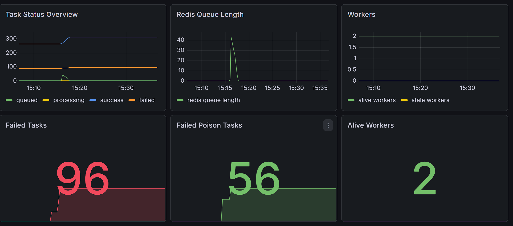
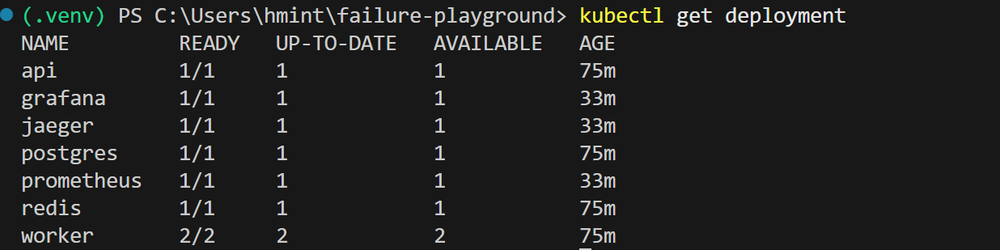
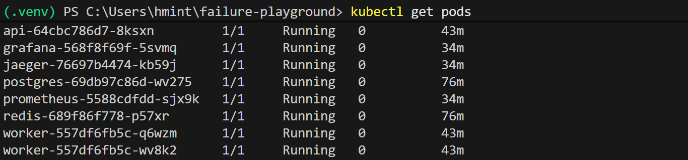
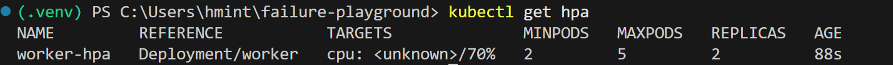

# Failure Playground

**Failure Playground** is a local **platform engineering and observability playground** for distributed task processing, operational visibility, resilience patterns, and Kubernetes-based deployment.

It models a small production-style platform using FastAPI, PostgreSQL, Redis, worker replicas, Prometheus, Grafana, OpenTelemetry, Jaeger, a realtime operations dashboard, and Kubernetes manifests for the application and observability stack.

The project is intentionally not a production-ready product. It is a systems playground for answering questions platform and infrastructure engineers care about:

- What happens when tasks fail, retry, or become poison?
- How do workers coordinate through a queue while PostgreSQL remains the source of truth?
- How does an operator notice queue pressure, slow workers, failure spikes, or stale workers?
- How can realtime events, metrics, logs, and traces be connected into one operational view?
- How does a Dockerized local stack map into Kubernetes Deployments, Services, persistent storage, and autoscaling?

---

## Current Status

**Current version:** `v4.0-d` - README Production Polish

The project now includes local Kubernetes manifests for the core application stack, observability stack, and worker autoscaling while preserving the existing Docker Compose workflow. The documentation now frames the project as a portfolio-grade platform engineering system rather than only a task queue demo.

Current dashboard capabilities include:

- WebSocket reconnect with exponential backoff and visible connection state
- Redis-backed operational event replay after refresh or reconnect
- `event_id`-based deduplication for replay-safe metrics
- Rolling failure-rate and retry metrics
- Delivery metrics for success, retry, and poison rates
- Per-worker throughput over rolling 10s / 60s windows
- Idle worker visibility
- Queue latency visualization
- Processing latency visualization
- `trace_id` / `span_id` propagation into realtime task lifecycle events
- Dashboard-to-Jaeger "Open Trace" links
- System Health analysis:
  - Healthy
  - Queue Pressure
  - Processing Bottleneck
  - Failure Spike
- Frontend Incident Workflow:
  - active
  - acknowledged
  - resolved

The dashboard is a compact local operations console: it shows what is happening now, reconstructs recent context after reconnects, explains system health in operator-facing language, tracks basic incident state, and links live events to distributed traces.

---

## Project Identity

Failure Playground is a **local backend/platform engineering project** focused on:

- Distributed worker coordination
- Queue-backed asynchronous processing
- Failure handling and retry behavior
- Observability across logs, metrics, traces, and realtime signals
- Operator experience during partial failure
- Engineering tradeoffs around replay, deduplication, and dashboard-derived metrics

It is designed to be understandable on one machine while still exposing problems that appear in larger production systems: duplicate delivery, stale workers, queue backlog, retry storms, latency buildup, trace correlation, and short-term incident context.

---

## Release Progression

- **v1:** task queue, worker processes, retries, poison tasks, and a Dockerized FastAPI/PostgreSQL/Redis stack.
- **v2:** WebSocket operations dashboard, reconnect recovery, Redis replay history, and `event_id` deduplication.
- **v3:** OpenTelemetry tracing, Jaeger trace links, latency charts, throughput monitoring, System Health, Delivery Metrics, and Incident Workflow.
- **v4:** Kubernetes core stack, Kubernetes observability stack migration, and worker autoscaling with a HorizontalPodAutoscaler.

---

## Core Stack

### Backend

- FastAPI for the HTTP control plane and WebSocket event bridge
- SQLAlchemy for data access
- PostgreSQL for durable task, log, worker, and system state
- Redis for task queueing, pub/sub, and bounded event replay history
- Alembic for database migrations

### Workers

- Independent Python worker processes
- Redis queue consumers
- PostgreSQL task-state transitions
- Retry, backoff, poison-task handling, and stuck-task recovery
- OpenTelemetry spans around task lifecycle operations

### Observability

- Structured JSON operational events
- Prometheus scrape endpoint
- Grafana dashboard
- OpenTelemetry tracing
- Jaeger trace UI
- Realtime browser dashboard

### Dashboard

- Vanilla JavaScript
- Native WebSocket API
- Chart.js for compact charts
- No separate frontend build pipeline

---

## Architecture

Failure Playground has three connected layers. The diagram below reflects the v4.0 system after System Health, Delivery Metrics, Incident Workflow, Kubernetes deployment manifests, Kubernetes observability manifests, and worker autoscaling.

- **Application layer:** FastAPI provides the HTTP control plane, API docs, health checks, `/prometheus` endpoint, and WebSocket bridge. Worker replicas consume Redis queue entries, update PostgreSQL state, emit heartbeats, and simulate retries, poison tasks, stuck work, and failures.
- **Operational signal layer:** Redis acts as a queue, a pub/sub event bus, and bounded replay history. The WebSocket operations dashboard consumes replayed and live WebSocket events, and Redis replay makes refresh/reconnect recovery possible.
- **Operator intelligence layer:** Operator-facing metrics are derived from event history, including Failure Rate Metrics, Delivery Metrics, Queue Latency Metrics, Processing Latency Metrics, Per-worker Throughput, System Health, and Incident Workflow state.
- **Observability and platform layer:** OpenTelemetry connects API and worker spans to Jaeger, Prometheus scrapes the FastAPI `/prometheus` endpoint, and Grafana visualizes system dashboards. Kubernetes now runs the core and observability stack through manifests with Deployments, Services, a PostgreSQL PersistentVolumeClaim, shared ConfigMap configuration, and a worker HorizontalPodAutoscaler.

```
                                  +-------------------+
                                  | WebSocket         |
                                  | Dashboard         |
                                  |                   |
                                  | - live events     |
                                  | - event details   |
                                  | - Open Trace      |
                                  +---------+---------+
                                            |
                                            | derives replay-safe operator metrics
                                            v
            +---------------------------------------------------------------+
            | Dashboard Analysis                                            |
            | - Failure Rate Metrics                                        |
            | - Queue Latency Metrics                                       |
            | - Processing Latency Metrics                                  |
            | - Per-worker Throughput                                       |
            | - System Health Analysis                                      |
            | - Incident Workflow                                           |
            +---------------------------------------------------------------+
                                            ^
                                            |
                         replay + live      |      WebSocket /ws/operations
                         events             |
                                            |
+------------+     HTTP      +--------------+---------------+
| Operators  +-------------->| FastAPI API                  |
| / clients  |               | - REST control plane         |
+------------+               | - WebSocket bridge           |
                             | - Prometheus endpoint        |
                             +------+-----------+-----------+
                                    |           |
                  task state/logs   |           | enqueue task IDs
                                    v           v
                         +----------+--+     +--+----------------+
                         | PostgreSQL |     | Redis Queue        |
                         | - tasks    |     | - task IDs         |
                         | - logs     |     +--+----------------+
                         | - workers  |        |
                         | - state    |        | dequeue task IDs
                         +----------+-+        v
                                    |     +----+----------------+
                                    |     | Workers             |
                                    |     | - claim tasks       |
                                    |     | - process/retry     |
                                    |     | - heartbeat         |
                                    |     +----+----------------+
                                    |          |
                                    |          | operational events
                                    |          v
                                    |     +----+----------------+
                                    |     | Redis Pub/Sub       |
                                    |     | Event Bus           |
                                    |     +----+----------------+
                                    |          |
                                    |          | persisted recent events
                                    |          v
                                    |     +----+----------------+
                                    |     | Redis Replay        |
                                    |     | History             |
                                    |     | latest 100 events   |
                                    |     +----+----------------+
                                    |          |
                                    +----------+-------> FastAPI WebSocket bridge

        +--------------------+                 +------------------+
        | OpenTelemetry      | spans/traces    | Jaeger           |
        | API + Workers      +---------------->| trace UI         |
        +--------------------+                 +------------------+
                                                        ^
                                                        |
                    Dashboard Event -> Trace ID --------+

        +--------------------+   scrape /prometheus   +------------------+
        | Prometheus         |<----------------------- | FastAPI API      |
        +---------+----------+                         +------------------+
                  |
                  v
        +--------------------+
        | Grafana            |
        | system dashboards  |
        +--------------------+
```

The runtime has three main paths:

- **Task execution path:** operators call the FastAPI API, the API writes task state to PostgreSQL and pushes task IDs into the Redis Queue, and workers dequeue and process those tasks.
- **Realtime operations path:** API and workers emit operational events into the Redis Pub/Sub Event Bus. The API also stores recent events in Redis Replay History and bridges replay + live events to the WebSocket Dashboard.
- **Observability path:** API and workers emit OpenTelemetry traces to Jaeger, while Prometheus scrapes the FastAPI metrics endpoint and Grafana visualizes longer-term system metrics.

Redis is intentionally split into three operational roles:

- **Queue:** transports task IDs from API to workers.
- **Pub/sub event bus:** streams operational events from API/workers to the WebSocket bridge.
- **Replay history:** stores the latest 100 non-heartbeat operational events for dashboard refresh/reconnect recovery.

The dashboard does not store its own backend metrics. It derives Failure Rate Metrics, Delivery Metrics, Queue Latency Metrics, Processing Latency Metrics, Per-worker Throughput, System Health Analysis, and the frontend Incident Workflow from replay-safe operational events and the existing `/metrics` endpoint.

Trace correlation flows from task lifecycle spans into realtime events: a dashboard event displays `trace_id` / `span_id`, and the Open Trace action opens the matching Jaeger trace at `http://localhost:16686/trace/{trace_id}`.

PostgreSQL remains the source of truth for task state. Redis is treated as transport and short-term operational memory, which creates realistic distributed-system edges such as duplicate messages, stale processing rows, and replay boundaries.

---

## Dashboard Overview

The realtime operations dashboard combines live operational events,
replay-safe metrics, trace correlation, incident workflow tracking,
and operator-facing system health interpretation.


## Backend Systems

### Task Queue

The API creates task records in PostgreSQL and enqueues task IDs in Redis. Workers pull IDs from Redis, claim queued tasks, and update PostgreSQL as the task moves through processing, success, retry, failure, or poison states.

This separation is deliberate: the queue and database can disagree, and the worker logic has to handle duplicate claims, stuck tasks, retry cooldowns, and missing task IDs.

### Worker Lifecycle

Workers are independent processes responsible for:

- Pulling task IDs from Redis
- Claiming queued tasks (`queued -> processing`)
- Simulating success or failure
- Retrying failed work with exponential backoff
- Marking poison tasks as terminal failures
- Recording processing duration
- Updating heartbeat records
- Publishing realtime operational events
- Creating OpenTelemetry spans for task lifecycle operations

### Reliability Behaviors

- **Heartbeats:** workers update heartbeat rows; stale workers are visible in the dashboard.
- **Stuck task recovery:** long-running `processing` tasks are recovered and re-queued or failed.
- **Retry cooldowns:** retries are scheduled instead of immediate to avoid tight loops.
- **Poison handling:** poison tasks eventually become terminal failures.
- **Duplicate prevention:** workers skip tasks that are no longer queued.
- **Rate limiting:** workers can throttle processing when they exceed configured limits.
- **System pause/resume:** operators can pause and resume task processing.

---

## Realtime Operational Signals

Operational events are emitted by the API and workers as structured JSON payloads. They are published to Redis pub/sub, persisted in a bounded Redis replay list, and bridged to the browser via `/ws/operations`.

Examples include:

- `task_created`
- `task_enqueued`
- `task_claimed`
- `task_started`
- `task_succeeded`
- `task_failed`
- `task_retried`
- `task_poisoned`
- `worker_heartbeat`
- `worker_processed_count_updated`

Each persisted event includes:

- `event_id`
- `timestamp`
- `event`
- event-specific task/worker fields
- trace fields when available

### Event Replay

The API stores the latest 100 non-heartbeat operational events in Redis. When a dashboard connects, the API sends that replay history first, then streams new live events.

This means a page refresh or WebSocket reconnect does not wipe out the operator's short-term incident context.

### Reconnect Recovery

The dashboard tracks WebSocket connection state:

- Connected
- Disconnected
- Reconnecting
- Reconnected

Unexpected disconnects trigger automatic reconnect with simple exponential backoff. When the socket reconnects, Redis replay restores recent events before live streaming continues.

### Replay-Safe Metrics

Each event has a stable `event_id`. The dashboard keeps a bounded set of received IDs and ignores duplicates. This prevents replayed events from inflating:

- failure-rate calculations
- delivery metrics
- retry counts
- worker throughput
- queue latency
- processing latency
- live event counters
- system health interpretation
- incident workflow transitions

### Operational Interpretation

The realtime dashboard does not only render event rows. It derives short-window operational signals from the event stream:

- Is the system failing recently?
- Are tasks succeeding, retrying, or becoming poison at concerning rates?
- Are workers keeping up?
- Are tasks waiting too long in the queue?
- Are workers spending too long processing tasks?
- Is the current state healthy or degraded?
- Has a degraded state opened, updated, or resolved a local incident?

That operator-facing interpretation is what makes the dashboard more than a WebSocket log viewer.

---

## Operational Dashboard

The browser dashboard is the primary local operations console. It ships from the FastAPI app and uses vanilla JavaScript; there is no separate frontend service.

### Live Event Console

- Realtime event stream over WebSocket
- Redis replay after refresh/reconnect
- Historical replay tagging
- Event severity styling
- Event filtering by task/failure/retry/worker
- Event search
- Pause/resume live stream display
- Event detail drawer with full JSON payload

### Connection Resilience

- Visible connection status badge
- Automatic reconnect with exponential backoff
- Reconnected state before returning to Connected
- WebSocket cleanup on page lifecycle events
- Replay-safe recovery after reconnect

### Failure Rate

- Rolling failure percentage over recent windows
- Retry count display
- Terminal event count display
- Recalculation from replayed history
- Live updates as task outcomes arrive

### Delivery Metrics

- Success rate over the selected recent window
- Retry rate over the selected recent window
- Poison rate over the selected recent window
- Event count used in the calculation
- Rebuilt from Redis replay and updated live after `event_id` deduplication

The panel uses the existing operational event stream:

- `task_succeeded` contributes to success rate
- `task_retried` contributes to retry rate
- `task_poisoned` contributes to poison rate

### Worker Throughput

- Per-worker processing rate
- Rolling 10s / 60s window selector
- Idle workers remain visible as `0/sec`
- Rebuilt from replayed worker events
- Updated live as workers process tasks

### Queue Latency

Queue latency answers:

> How long did this task wait before a worker started it?

Calculation:

```
task_started.timestamp - task_started.queued_at
```

The dashboard prefers replay-resilient fields on `task_started`:

- `queued_at`
- `created_at`

If those are missing, it falls back to matching `task_created` and `task_started` by `task_id`.

Displayed values:

- latest wait
- average wait
- max wait
- recent task count

### Processing Latency

Processing latency answers:

> How long did a worker spend actively processing the task?

Calculation:

```
terminal_event.timestamp - terminal_event.processing_started_at
```

Terminal events:

- `task_succeeded`
- `task_failed`
- `task_poisoned`

The dashboard prefers replay-resilient terminal event fields:

- `started_at`
- `processing_started_at`

If those are missing, it falls back to matching `task_started` by `task_id`.

Displayed values:

- latest processing duration
- average processing duration
- max processing duration
- recent task count

### System Health

The System Health panel provides operator-facing interpretation derived from existing metrics and events.

Possible states:

- **Healthy:** no active pressure or spike detected
- **Queue Pressure:** queue depth or queue wait time indicates workers are falling behind
- **Processing Bottleneck:** workers are spending too long actively processing tasks
- **Failure Spike:** recent terminal outcomes are failing at a high rate

The panel includes the reason for the selected state, such as queue depth, recent failure percentage, average queue wait, or average processing duration.

The logic is intentionally simple and explainable. It is derived from:

- `/metrics` queue depth and task counts
- replay-safe failure-rate events
- worker heartbeat freshness
- queue latency samples
- processing latency samples

### Incident Workflow

The Incident Workflow panel turns System Health into a small local operator workflow.

When System Health enters a non-Healthy state, the dashboard creates or updates one active incident for the continuous degraded period. The incident record includes:

- incident id
- incident type / health state
- status
- created timestamp
- acknowledged timestamp
- resolved timestamp
- summary

Supported incident states:

- **active:** System Health is currently degraded and the incident has not been acknowledged
- **acknowledged:** an operator clicked Acknowledge in the dashboard
- **resolved:** System Health returned to Healthy

Acknowledgement is frontend-only and does not call the backend. Resolved incidents remain visible in Incident History, and the current workflow state is stored in browser-local state so a refresh can reconstruct the most recent incident context as far as the replayed health signals allow.

### Trace Correlation

Task lifecycle events include OpenTelemetry trace fields when a span is active:

- `trace_id`
- `span_id`

The event detail drawer displays those fields and shows an **Open Trace** action when `trace_id` is present.

Flow:

```
dashboard event
      |
      v
trace_id / span_id
      |
      v
Open Trace
      |
      v
Jaeger: http://localhost:16686/trace/{trace_id}
```

This makes a live failure, retry, or poison event directly actionable: the operator can jump from a realtime dashboard event to the distributed trace for that task.

### Distributed Trace Example

The dashboard can jump directly from a realtime event
to the matching Jaeger trace.


---

## Operational Resilience Features

### WebSocket Reconnect Recovery

The dashboard reconnects automatically when `/ws/operations` closes unexpectedly. It uses a simple backoff sequence up to a maximum delay and exposes state through the UI so operators can see whether the live stream is connected, disconnected, reconnecting, or recently reconnected.

### Redis Replay Persistence

The API keeps a bounded Redis history of the latest 100 non-heartbeat operational events. New dashboard clients receive replay first, then live events.

This keeps recent context available across:

- page refresh
- browser reconnect
- API/WebSocket restart
- short network interruption

### Event Deduplication

Every persisted event has an `event_id`. The dashboard deduplicates by that ID before updating live event counters or derived metrics.

This protects the dashboard from double-counting when the same event is replayed and then received live.

### Replay-Safe Metric Reconstruction

The dashboard rebuilds derived metrics from replayed events:

- failure rate
- delivery metrics
- retries
- per-worker throughput
- queue latency
- processing latency
- system health
- incident workflow state

Latency events carry enough timestamp context to survive replay trimming:

- `task_started.created_at`
- `task_started.queued_at`
- terminal event `started_at`
- terminal event `processing_started_at`

When those fields are available, metrics do not require both sides of an event pair to still exist in the 100-event replay window.

---

## Observability Layers

Failure Playground uses four observability layers, each answering a different question:

| Layer | Tooling | Question |
|-------|---------|----------|
| Logs | Structured JSON logs | What happened? |
| Metrics | Prometheus + Grafana | How much, how often, and how saturated? |
| Traces | OpenTelemetry + Jaeger | How did one task move through the system? |
| Realtime signals | Redis pub/sub + WebSocket dashboard | What is happening right now, and what should an operator notice? |

### Structured Logs

The backend emits structured JSON logs for task lifecycle events, worker behavior, retries, failures, and health updates. These logs are designed to be machine-parseable and useful during debugging.

### Prometheus and Grafana

`/prometheus` exposes metrics such as:

- `failure_playground_tasks_queued`
- `failure_playground_tasks_processing`
- `failure_playground_tasks_success`
- `failure_playground_tasks_failed`
- `failure_playground_tasks_poison`
- `failure_playground_tasks_poison_failed`
- `failure_playground_redis_queue_length`
- `failure_playground_workers_alive`
- `failure_playground_workers_stale`

Grafana is provisioned through Docker Compose with a Prometheus datasource and dashboard panels for queue pressure, task state, worker health, retry/failure behavior, and throughput.

### Grafana Dashboard

Prometheus metrics are visualized through Grafana dashboards
covering queue pressure, latency, throughput, and worker health.



### OpenTelemetry and Jaeger

Traced services:

- `failure-playground-api`
- `failure-playground-worker`

Worker spans include:

```
worker.process_task
worker.claim_task
worker.retry_task
worker.fail_task
worker.complete_task
worker.recover_stuck_task
```

Worker polling is intentionally not heavily traced. Empty queue polls would dominate Jaeger and obscure the task-processing spans that matter.

---

## Failure Scenarios Supported

- Random task failure
- Retry with exponential backoff
- Permanent failure after max retries
- Poison tasks
- Queue pressure and backlog
- Slow processing / processing bottlenecks
- Stale workers
- Duplicate task prevention
- Stuck task recovery
- System pause/resume
- Redis queue clearing
- Degraded dependency health
- WebSocket disconnect and reconnect

---

## Key Endpoints

| Method | Endpoint | Description |
|--------|----------|-------------|
| GET | `/` | Operational dashboard |
| GET | `/docs` | FastAPI documentation |
| GET | `/health` | API, PostgreSQL, and Redis health |
| GET | `/metrics` | Human-readable metrics |
| GET | `/prometheus` | Prometheus scrape endpoint |
| WS | `/ws/operations` | Realtime operational event stream |
| POST | `/tasks` | Create a normal or poison task |
| POST | `/tasks/bulk` | Create multiple tasks |
| POST | `/tasks/{task_id}/retry` | Manually retry a task |
| POST | `/tasks/{task_id}/duplicate` | Duplicate a task |
| GET | `/tasks` | Paginated and filterable task list |
| GET | `/tasks/{task_id}` | Task detail |
| GET | `/logs` | Paginated task logs |
| GET | `/workers` | Worker heartbeat and processed counts |
| POST | `/workers/reset-counts` | Reset worker processed counts |
| GET | `/alerts` | Operational alerts |
| DELETE | `/alerts` | Clear alerts |
| GET | `/system-state` | Pause/resume state |
| POST | `/pause` | Pause task processing |
| POST | `/resume` | Resume task processing |
| DELETE | `/queue` | Clear Redis queue |
| DELETE | `/reset` | Reset system state |
| GET | `/report` | HTML system report |
| GET | `/dead-letter` | Dead-letter task view |

---

## Running Locally

From the project root:

```bash
docker compose up --build
```

When the API container starts, it runs Alembic migrations before launching the FastAPI server.

Open:

- Dashboard: <http://localhost:8001>
- API docs: <http://localhost:8001/docs>
- Prometheus: <http://localhost:9091>
- Grafana: <http://localhost:3000>
- Jaeger: <http://localhost:16686>

Default Grafana login:

```text
Username: admin
Password: admin
```

Create a task:

```bash
curl -X POST "http://localhost:8001/tasks?priority=1"
```

Create a poison task:

```bash
curl -X POST "http://localhost:8001/tasks?priority=1&is_poison=true"
```

Watch the realtime event stream from the command line:

```bash
# Any WebSocket client works; example uses websocat
websocat ws://localhost:8001/ws/operations
```

---
## Kubernetes Deployment Verification

The platform now runs on Kubernetes using Deployments, Services,
a PostgreSQL PersistentVolumeClaim, and a worker HPA.







---

### Linux Development Environment

The project is now developed and verified primarily on Linux/Ubuntu.

Linux is used for:

- Docker and Kubernetes local runtime
- kubectl-based deployment verification
- container image builds
- log inspection
- port forwarding
- local platform operations practice

The Docker Compose workflow still works, but the Kubernetes workflow is now the main platform-engineering path for v4.0 verification.


## Running The Stack On Kubernetes

The Kubernetes manifests under [k8s/](/C:/Users/hmint/failure-playground/k8s) map the Docker Compose stack into local Kubernetes primitives without changing the Compose workflow.

- `api`, `worker`, `postgres`, and `redis` run as Deployments.
- `api-service`, `postgres-service`, and `redis-service` provide in-cluster DNS and stable networking.
- The worker runs as a replica-based Deployment, replacing Compose `worker-a` and `worker-b`.
- Compose `postgres_data` maps to a PostgreSQL PersistentVolumeClaim.
- Shared environment configuration maps to a Kubernetes ConfigMap.
- Jaeger, Prometheus, and Grafana run as Kubernetes Deployments and Services.
- Worker autoscaling is handled by `worker-hpa`, with 2 to 5 replicas and a 70% CPU utilization target.

Grafana runs on Kubernetes, but dashboard provisioning may remain Docker Compose-first until that setup is worth migrating cleanly.

Build the backend image from the existing Dockerfile:

```bash
docker build -t failure-playground-backend:latest ./backend
```

Apply the manifests:

```bash
kubectl apply -f k8s/
kubectl get pods
kubectl get svc
kubectl get hpa
kubectl logs deployment/api
kubectl logs deployment/worker
```

Open the API locally:

```bash
kubectl port-forward service/api-service 8001:8000
```

Then open:

- Dashboard: <http://localhost:8001>
- API docs: <http://localhost:8001/docs>

Access the observability tools:

```bash
kubectl port-forward service/jaeger-service 16686:16686
kubectl port-forward service/prometheus-service 9091:9090
kubectl port-forward service/grafana-service 3000:3000
```

- Jaeger: <http://localhost:16686>
- Prometheus: <http://localhost:9091>
- Grafana: <http://localhost:3000>

Kubernetes does not support Docker Compose `depends_on` directly. The manifests use service discovery, pod restarts, and readiness/liveness probes where reasonable. The Kubernetes service names used by the app are `postgres-service`, `redis-service`, and `jaeger-service`. Prometheus scrapes `/prometheus` through `api-service:8000`.

The worker HPA keeps the worker Deployment between 2 and 5 pods and targets 70% average CPU utilization. It requires `metrics-server` to be available in the local Kubernetes cluster; unknown HPA CPU metrics usually mean `metrics-server` is missing or not ready.

Useful verification commands:

```bash
kubectl apply -f k8s/
kubectl get pods
kubectl get svc
kubectl get hpa
kubectl logs deployment/api
kubectl logs deployment/worker
kubectl logs deployment/jaeger
kubectl logs deployment/prometheus
kubectl logs deployment/grafana
```

The full Kubernetes runbook is in [k8s/README.md](/C:/Users/hmint/failure-playground/k8s/README.md).

---

## Tests

From the `backend` directory:

```bash
cd backend
pytest -v
```

The test suite covers:

- task creation and API behavior
- Redis queue enqueue/dequeue behavior
- queue length and clear behavior
- system pause/resume
- pagination, filtering, and validation
- structured event logging
- Redis event persistence and replay
- trace context propagation in event payloads
- worker success, retry, final failure, poison, and recovery paths
- queue-latency and processing-latency event payload fields

Tests use pytest, FastAPI TestClient, temporary SQLite databases, and fake Redis implementations where appropriate.

---

## CI

GitHub Actions runs the backend test suite on push and pull request:

```text
push / pull_request
        |
        v
install dependencies
        |
        v
run pytest
```

---

## Engineering Tradeoffs

This project intentionally favors clear operational mechanics over production-scale abstraction.

- Redis replay history is bounded to keep the system simple and local.
- Dashboard metrics are derived from operational events rather than a dedicated analytics backend.
- WebSocket replay is designed for short-term operator context, not long-term audit.
- Trace context is added to events so the dashboard can link symptoms to Jaeger without introducing a separate correlation service.
- Worker polling is not heavily traced to keep Jaeger focused on meaningful task lifecycle spans.
- The dashboard is vanilla JavaScript so the operational behavior is visible without a frontend build system.

These tradeoffs keep the playground small enough to understand while still surfacing realistic platform engineering problems.

---

## Version History

### v4.0-d - README Production Polish

- Reframed the project as a platform engineering and observability portfolio system
- Clarified architecture across API, workers, Redis, PostgreSQL, WebSocket dashboard, OpenTelemetry, Jaeger, Prometheus, Grafana, and Kubernetes
- Added release progression from v1 through v4
- Improved Kubernetes deployment, verification, observability access, limitations, and roadmap documentation
- Existing Docker Compose workflow preserved

### v4.0-c — Kubernetes Worker Autoscaling

- Worker Deployment now has CPU and memory requests and limits
- Added `worker-hpa` HorizontalPodAutoscaler
- Worker autoscaling keeps 2 to 5 replicas
- HPA targets 70% average CPU utilization
- Documented `metrics-server` requirement for local Kubernetes clusters
- Existing Docker Compose workflow preserved

### v4.0-b — Kubernetes Observability Stack Migration

- Kubernetes manifests for Jaeger, Prometheus, and Grafana
- Jaeger exposed through `jaeger-service` on UI, OTLP gRPC, and OTLP HTTP ports
- API and workers export OpenTelemetry traces to `http://jaeger-service:4317`
- Prometheus config migrated to a Kubernetes ConfigMap
- Prometheus scrapes the API through `api-service:8000`
- Prometheus exposed through `prometheus-service`
- Grafana exposed through `grafana-service`
- Grafana dashboard provisioning may remain Docker Compose-first for now
- Existing Docker Compose workflow preserved

### v4.0-a — Kubernetes Core Stack Migration

- Kubernetes manifests for the core API, workers, Redis, and PostgreSQL stack
- API exposed through `api-service`
- PostgreSQL exposed through `postgres-service`
- Redis exposed through `redis-service`
- Worker deployment replaces `worker-a` and `worker-b` with 2 replicas
- Worker pod names are used as worker names through the Kubernetes Downward API
- Shared ConfigMap for local Kubernetes runtime configuration
- PostgreSQL PersistentVolumeClaim for local database persistence
- Observability stack migration explicitly deferred to v4.0-b
- Existing Docker Compose workflow preserved

### v3.7 — Incident Workflow

- Incident Workflow panel driven by System Health state
- Active, acknowledged, and resolved incident states
- Frontend acknowledgement without backend API calls
- Automatic incident resolution when System Health returns to Healthy
- Incident records with id, type, status, timestamps, and summary
- Local reconstruction across refresh/reconnect using replay-safe health inputs and browser-local workflow state

### v3.6 — Dashboard Delivery Metrics

- Delivery Metrics panel
- Success rate, retry rate, and poison rate over recent windows
- Replay-safe reconstruction from Redis event history
- Reconnect-safe and refresh-safe calculations through `event_id` deduplication

### v3.5 — System Health and Bottleneck Detection

- System Health panel
- Healthy / Queue Pressure / Processing Bottleneck / Failure Spike states
- Operator-facing explanation for each selected state
- Health interpretation derived from existing metrics and replay-safe event samples

### v3.4 — Processing Latency Visualization

- Processing latency panel
- Active processing duration from terminal event timestamp minus processing start timestamp
- Terminal events include `started_at` / `processing_started_at`
- Replay-resilient processing latency reconstruction
- Success, failed, and poison terminal outcomes included

### v3.3 — Queue Latency Visualization

- Queue latency panel
- Queue wait time from `task_started.timestamp - queued_at/created_at`
- `task_started` includes `created_at` / `queued_at`
- Fallback matching by `task_id` when direct timestamps are unavailable
- Replay-resilient queue latency reconstruction

### v3.2 — Jaeger Trace Links

- Event detail drawer includes an Open Trace action when `trace_id` exists
- Local Jaeger links use `http://localhost:16686/trace/{trace_id}`
- Events without trace context hide the trace action

### v3.1 — Trace Correlation in Realtime Events

- Task lifecycle events include `trace_id` and `span_id` when tracing is active
- Replayed events preserve trace fields
- Dashboard event detail drawer displays trace fields

### v2.4 — Per-Worker Throughput

- Worker Throughput panel
- Rolling 10s / 60s per-worker processing rates
- Idle workers remain visible as `0/sec`
- Rebuilt from replayed worker events

### v2.3 — Rolling Failure Rate

- Rolling failure-rate visualization
- Retry count and terminal event count
- Recalculation from replayed event history
- Replay-safe failure/retry metrics

### v2.2 — Event Persistence and Replay

- Redis-backed latest-100 operational event history
- Replay on dashboard connect/reconnect
- `event_id`-based deduplication
- Historical replay tagging in the live event stream

### v2.1 — WebSocket Reconnect Handling

- Automatic reconnect after unexpected WebSocket close
- Exponential backoff
- Connection status badge
- Reconnected state without page refresh
- Cleanup of sockets and timers on page lifecycle events

### v2.0 — Realtime Operations Dashboard

- Redis pub/sub operational event bus
- FastAPI `/ws/operations` WebSocket bridge
- Live event stream with filtering and search
- Worker heartbeat cards
- Stale worker detection and recovery tracking
- Failure spike alert banner
- Toast notifications
- Incident history
- Event detail drawer
- Severity-based event styling

### v1.5 — Observability Foundation

- OpenTelemetry tracing across API and workers
- Custom worker spans
- Jaeger integration
- Prometheus metrics
- Grafana provisioning
- Structured JSON logging
- Alembic migrations
- Backend tests and GitHub Actions CI

### v1.0 — Backend Foundation

- FastAPI control plane
- PostgreSQL persistence
- Redis-backed task queue
- Worker queue consumers
- Retry, backoff, and poison-task handling
- Stuck task recovery
- System pause/resume
- Polling-based dashboard

---

## Known Limitations

Failure Playground is designed for local platform engineering learning and portfolio demonstration, not production readiness.

- Kubernetes manifests target single-node or local clusters.
- Incident Workflow state is frontend-only.
- Grafana dashboard provisioning may still be Docker Compose-first.
- There is no authentication, authorization, or RBAC yet.
- There is no persistent incident storage yet.
- PostgreSQL and Redis are local containerized services, not production-grade managed database or cache setups.
- Worker HPA requires `metrics-server` to be installed and healthy in the local cluster.
- Redis replay history is intentionally limited to the latest 100 non-heartbeat events.
- Realtime operational history is short-term operator context, not audit-grade retention.

---

## Next Roadmap

- **v5.0:** CI/CD with GitHub Actions for build, test, and deployment validation.
- **v5.1:** Prometheus alert rules for queue pressure, worker health, failure spikes, and dependency degradation.
- **v5.2:** RBAC for dashboard operations, separating read-only visibility from destructive controls.
- **v6.0:** Kafka or another durable event-streaming layer for replay, consumer lag, partitioning, and event retention experiments.
