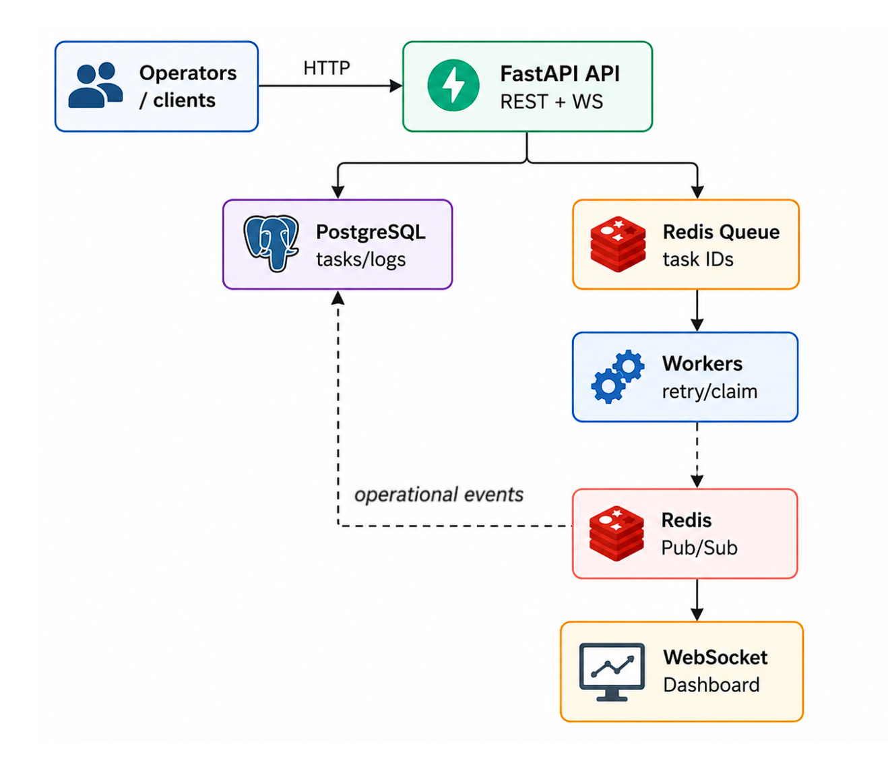

# Failure Playground

[](https://github.com/hmintopia03/failure-playground/actions/workflows/ci.yml)

## Overview

**Failure Playground** is a platform engineering project that simulates distributed task processing failures and recovery patterns.

It combines a FastAPI control plane, PostgreSQL persistence, Redis-backed worker queues, OpenTelemetry tracing, Prometheus/Grafana monitoring, Kubernetes deployment, and GitHub Actions CI/CD into a single local platform.

The goal is to explore how operators detect, investigate, and recover from queue pressure, worker failures, retry storms, stale workers, and other operational issues commonly found in production systems.

It is intentionally scoped for learning and portfolio review rather than production use.

Deep implementation notes live outside the landing page:

- Dashboard internals: see [docs/dashboard.md](docs/dashboard.md)
- Reliability mechanics: see [docs/reliability.md](docs/reliability.md)
- Observability details: see [docs/observability.md](docs/observability.md)

---

## Highlights

- Multi-worker distributed task processing
- Retry, backoff, poison-task, and stuck-task recovery flows
- Real-time operations dashboard with replay-safe metrics
- OpenTelemetry tracing with Jaeger correlation
- Prometheus and Grafana observability stack
- Kubernetes deployment with Horizontal Pod Autoscaling
- GitHub Actions CI pipeline validating tests, Docker builds, and Kubernetes manifests

---

## Architecture

Failure Playground models a small production-style platform focused on reliability, observability, and operational visibility.

The system consists of four main layers:

- **Application Layer** ??FastAPI provides the HTTP control plane, health endpoints, metrics endpoint, and WebSocket bridge. Workers consume tasks, perform retries, update task state, and emit operational events.
    
- **Operational Signals Layer** ??Redis serves as the task queue, pub/sub event bus, and bounded replay history used for dashboard recovery after refresh or reconnect.
    
- **Observability Layer** ??OpenTelemetry traces flow to Jaeger, while Prometheus scrapes application metrics and Grafana visualizes system behavior.
    
- **Platform Layer** ??The stack runs through Docker Compose locally and Kubernetes manifests for deployment, persistent storage, observability services, and worker autoscaling.
    




Observability:
FastAPI + Workers -> OpenTelemetry -> Jaeger
FastAPI /prometheus -> Prometheus -> Grafana

Platform:
Docker Compose locally
Kubernetes manifests + HPA
GitHub Actions: tests + Docker builds + Kubernetes validation
```

### Runtime Flows

**Task Processing**

FastAPI writes task state to PostgreSQL and pushes task IDs into Redis. Workers consume queued tasks, process them, and update task state.

**Realtime Operations**

API and workers publish operational events through Redis Pub/Sub. The WebSocket dashboard receives both replayed and live events for operational visibility.

**Observability**

OpenTelemetry traces are exported to Jaeger, while Prometheus collects metrics that Grafana uses for dashboards and system monitoring.

PostgreSQL remains the source of truth for task state. Redis is used as transport and short-term operational memory, creating realistic distributed-system scenarios such as duplicate delivery, stale workers, retry storms, and replay boundaries.

For the complete architecture notes, see [architecture.md](docs/architecture.md).

---

## Core Stack

### Backend

- FastAPI for the HTTP control plane and WebSocket event bridge
- SQLAlchemy for data access
- PostgreSQL for durable task, log, worker, and system state
- Redis for task queueing, pub/sub, and bounded event replay history
- Alembic for database migrations

### Workers

- Independent Python worker processes
- Redis queue consumers
- PostgreSQL task-state transitions
- Retry, backoff, poison-task handling, and stuck-task recovery
- OpenTelemetry spans around task lifecycle operations

### Observability

- Structured JSON operational events
- Prometheus scrape endpoint
- Grafana dashboard
- OpenTelemetry tracing
- Jaeger trace UI
- Realtime browser dashboard

### Dashboard

- Vanilla JavaScript
- Native WebSocket API
- Chart.js for compact charts
- No separate frontend build pipeline

---

## Dashboard Screenshot

The realtime operations dashboard combines live operational events,
replay-safe metrics, trace correlation, incident workflow tracking,
and operator-facing system health interpretation.


For dashboard internals, see [docs/dashboard.md](docs/dashboard.md). For observability details, see [docs/observability.md](docs/observability.md).

---

## Kubernetes

The platform runs on Kubernetes using Deployments, Services, a PostgreSQL PersistentVolumeClaim, shared ConfigMap configuration, and a worker HorizontalPodAutoscaler. The manifests live under [k8s/](k8s/), and the full runbook is in [k8s/README.md](k8s/README.md).


Key Kubernetes mapping:

- `api`, `worker`, `postgres`, `redis`, `jaeger`, `prometheus`, and `grafana` run as Deployments.
- Services provide stable in-cluster networking for API, Redis, PostgreSQL, Jaeger, Prometheus, and Grafana.
- `postgres-pvc` provides local PostgreSQL persistence.
- `worker-hpa` keeps the worker Deployment between 2 and 5 pods with a 70% CPU utilization target.
- Prometheus scrapes the API through `api-service:8000`.
- API and worker traces export to Jaeger through `http://jaeger-service:4317`.

Basic verification:

```bash
kubectl apply -f k8s/
kubectl get pods
kubectl get svc
kubectl get hpa
```

For reliability mechanics such as retries, poison tasks, and stuck-task recovery, see [docs/reliability.md](docs/reliability.md).

---

## CI/CD

GitHub Actions runs a production-style validation pipeline on push and pull request events targeting `main`.

```text
push / pull_request to main
        |
        +--> backend tests
        |       |
        |       +--> set up Python 3.13
        |       +--> install backend dependencies
        |       +--> run pytest
        |
        +--> Docker image builds
        |       |
        |       +--> validate docker compose config
        |       +--> build API image
        |       +--> build worker image
        |
        +--> Kubernetes validation
                |
                +--> set up kubectl and kind
                +--> server-side dry-run apply k8s manifests
```

The workflow checks:

- Backend dependency installation from [backend/requirements.txt](backend/requirements.txt)
- Backend test coverage with `pytest`
- Existing lint or format checks when project tooling is configured
- Dockerfile validity for API and worker images
- Docker Compose configuration validity
- Kubernetes manifest API compatibility with `kubectl apply --dry-run=server`

The CI pipeline is intentionally lightweight. It validates the current architecture without introducing a separate deployment platform, registry push, or heavyweight lint stack before the project needs one.

---

## Engineering Tradeoffs

This project intentionally favors clear operational mechanics over production-scale abstraction.

- Redis replay history is bounded to keep the system simple and local.
- Dashboard metrics are derived from operational events rather than a dedicated analytics backend.
- WebSocket replay is designed for short-term operator context, not long-term audit.
- Trace context is added to events so the dashboard can link symptoms to Jaeger without introducing a separate correlation service.
- Worker polling is not heavily traced to keep Jaeger focused on meaningful task lifecycle spans.
- The dashboard is vanilla JavaScript so the operational behavior is visible without a frontend build system.

These tradeoffs keep the playground small enough to understand while still surfacing realistic platform engineering problems.

---

## Known Limitations

Failure Playground is designed for local platform engineering learning and portfolio demonstration, not production readiness.

- Kubernetes manifests target single-node or local clusters.
- Incident Workflow state is frontend-only.
- Grafana dashboard provisioning may still be Docker Compose-first.
- There is no authentication, authorization, or RBAC yet.
- There is no persistent incident storage yet.
- PostgreSQL and Redis are local containerized services, not production-grade managed database or cache setups.
- Worker HPA requires `metrics-server` to be installed and healthy in the local cluster.
- Redis replay history is intentionally limited to the latest 100 non-heartbeat events.
- Realtime operational history is short-term operator context, not audit-grade retention.

---

## Running Locally

From the project root:

```bash
docker compose up --build
```

When the API container starts, it runs Alembic migrations before launching the FastAPI server.

Open:

- Dashboard: <http://localhost:8001>
- API docs: <http://localhost:8001/docs>
- Prometheus: <http://localhost:9091>
- Grafana: <http://localhost:3000>
- Jaeger: <http://localhost:16686>

Default Grafana login:

```text
Username: admin
Password: admin
```

Create a task:

```bash
curl -X POST "http://localhost:8001/tasks?priority=1"
```

Create a poison task:

```bash
curl -X POST "http://localhost:8001/tasks?priority=1&is_poison=true"
```

Watch the realtime event stream from the command line:

```bash
# Any WebSocket client works; example uses websocat
websocat ws://localhost:8001/ws/operations
```


Run backend tests from the `backend` directory:

```bash
cd backend
pytest -v
```
